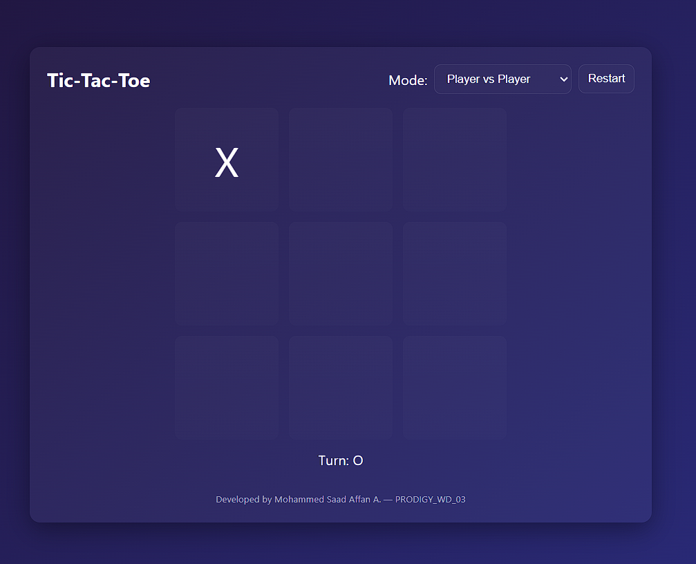
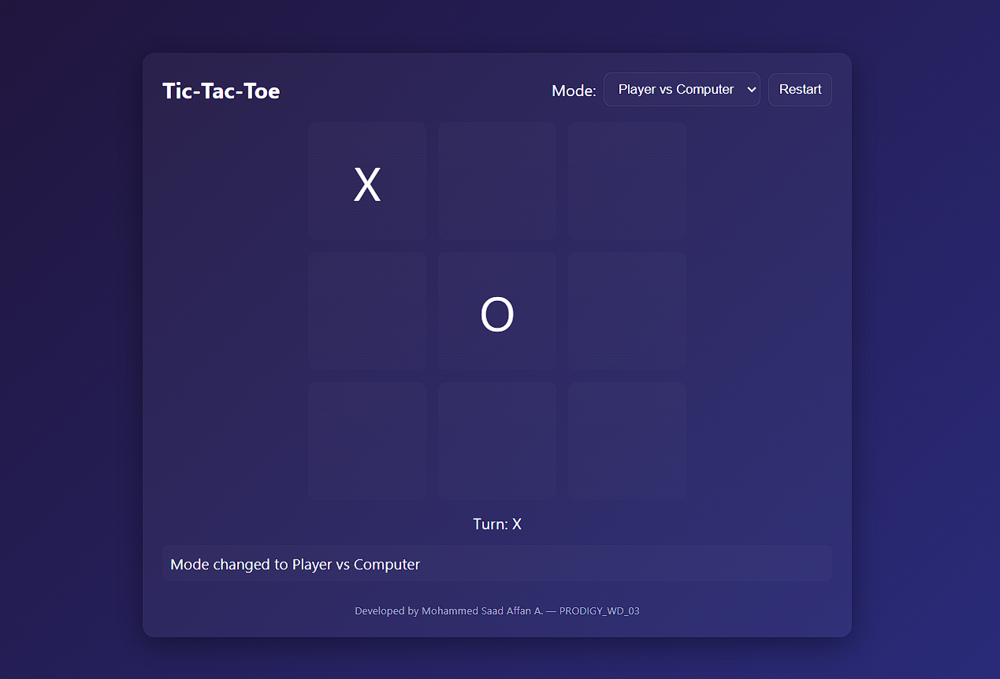
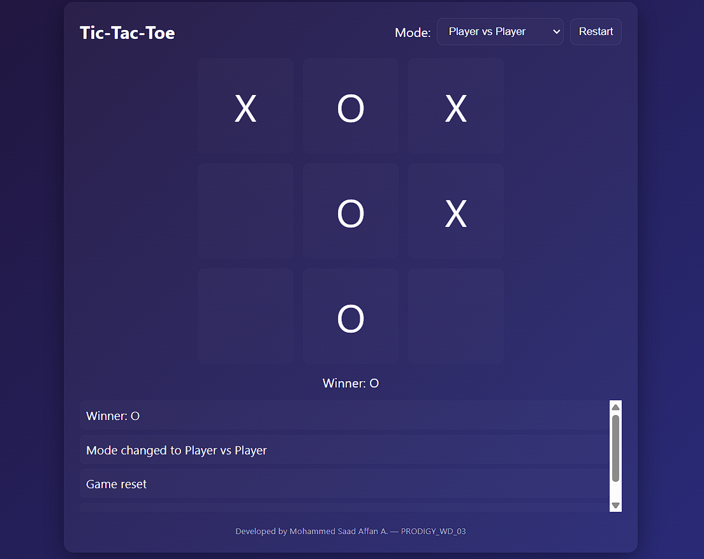

# Tic Tac Toe Web Application

A classic Tic Tac Toe game built as a web application using vanilla JavaScript, focusing on game logic, user interaction, and responsive UI design.:contentReference[oaicite:2]{index=2}

---

## Screenshots

### Home / Start Screen


### Gameplay Interface


### Result (Win/Draw)


---

## Features
- Two-player gameplay (no login/AI)
- Interactive game board with win/draw logic
- Reset button to start a new game
- Responsive and clean UI design:contentReference[oaicite:3]{index=3}

---

## Live Demo
👉 https://saad-affan12.github.io/tic-tac-toe-web-app/ :contentReference[oaicite:4]{index=4}

---

## Tech Stack
- HTML5  
- CSS3  
- JavaScript (DOM manipulation & game logic):contentReference[oaicite:5]{index=5}

---

## How to Run Locally
1. Clone the repository:
   ```bash
   git clone https://github.com/saad-affan12/tic-tac-toe-web-app.git
